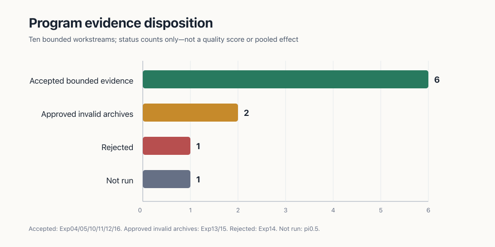
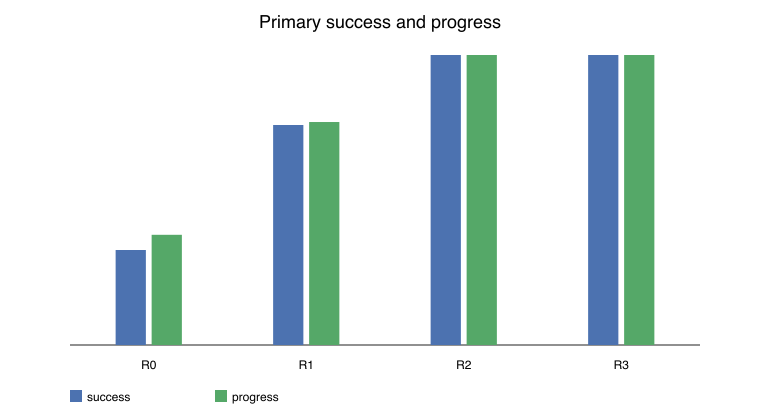

# Reflect Exp — Layered Robotics Research

Where should semantic reasoning, persistent memory, learned policies, motion recovery, and fast control meet in an embodied agent?

Reflect Exp is a multi-month robotics research program that answers that question through small, reproducible experiments instead of one opaque end-to-end demo. It includes a typed runtime, deterministic replay, MuJoCo and pure-Python studies, source provenance, compact result packs, and 645 automated tests.

> **Program status:** a typed, layered synthetic reference architecture is partially supported and the research continues. The repository does not claim a general-purpose robot system, real-sensor validation, or physical-robot transfer.

## The systems question

A robot needs several kinds of state and several speeds of decision-making. A durable object graph should not be overwritten by one uncertain camera frame. A local motion problem should not always wake a semantic planner. A recovery attempt should carry a reason, a deadline, and an escalation path.

The program therefore tests the seams between layers:

- which state should be durable, live, or episodic;
- when to refresh, retry, replan, or abort;
- how action chunks cross from learned policy to bounded execution;
- whether hierarchy reduces expensive high-level decisions without hiding failure;
- and where a learned world model or VLA can add measurable decision value.

## Architecture under study

The diagram is the conceptual system boundary being tested—not a claim that every arrow has already been validated.

~~~mermaid
flowchart TD
  A[Mission or instruction] --> B[Semantic planner and durable memory]
  B -->|typed SkillSpec| C[Policy or skill selection]
  C --> D[Action chunks and motion execution]
  D --> E[Bounded controller]
  E --> F[Simulator or robot interface]
  G[Live belief and episodic events] <--> B
  G --> D
  D -->|refresh, retry, replan, abort| B
~~~

## Program at a glance

| Dimension | Current state |
|---|---|
| Runtime | Typed events, rollout records, safety defaults, provenance, and deterministic replay |
| Experiments | Persistent memory, typed twins, recovery triggers, appearance transfer, action execution, and hierarchy |
| Evidence | Six workstreams accepted at deliberately bounded synthetic or engineering scopes |
| Scale | 645 tests across runtime contracts, replay, source auditing, artifact integrity, and experiments |
| Environments | Pure-Python constructed worlds and registered MuJoCo studies |
| Artifacts | Configs, seeds, manifests, hashes, raw or derived tables, figures, and review records |
| Safety | Simulation and offline work by default; physical deployment is disabled |
| Open seam | No accepted checkpoint-backed learned semantic-memory result yet |

## Selected findings

### Separate durable state, live belief, and episodic history

Controlled synthetic studies support keeping durable identity and geometry separate from inferred current state, while preserving episodic events as a separately addressable history. The important result is an interface decision: these stores can be composed at query time without silently overwriting one another.

### Let geometry carry motion through appearance change

In the registered opaque-to-glass-like appearance study, RGB-only execution completed 0 of 12 glass-like cases, while RGB-D motion and the hierarchy each completed 12 of 12. This is narrow synthetic transfer evidence, not a general perception result, but it cleanly identifies where geometry helped.

### Hierarchy reduced wake-ups without improving success

Exp16 compared registered scripted architectures on a fresh MuJoCo matrix. The three-layer R3 variant matched the two-layer R2 baseline on success, progress, and safety-violation rate while using 0.673 fewer total wakes per matched unit on average. That supports a bounded compute-routing result; it does not establish a universal hierarchy advantage or “lowest sufficient layer” law.

The exact definitions, intervals, sample units, invalid archives, rejected experiment, and non-claims are in the [program evidence ledger](reports/program-evidence/PROGRAM_EVIDENCE_LEDGER.md).

## Measured program evidence

*Measured program accounting, not a pooled effect size: six accepted bounded workstreams, two approved invalid archives, one rejected experiment, and one unrun learned-policy study.*

*Exp16 registered simulator matrix. R3 matched R2 on success and progress while reducing high-level wake-ups; this does not establish real-robot transfer or a universal hierarchy advantage.*

## How to explore the repository

| Start here | What it contains |
|---|---|
| [Research program](Reflect%20Lite%20Research%20Program.md) | Questions, safety envelope, experiment ladder, and stopping rules |
| [Program evidence ledger](reports/program-evidence/PROGRAM_EVIDENCE_LEDGER.md) | Accepted findings, exact scope, invalid work, and the current decision map |
| [Shared runtime](reflect/) | Typed events, rollout contracts, replay, and safety defaults |
| [Experiment index](experiments/) | Implementations, configs, protocols, and per-study results |
| [Exp16 compact evidence](reports/evidence/exp16-route-boundary-replication-v1/) | Registered route-boundary replication artifacts and figures |
| [Source registry](references/) | Pinned upstream projects, compatibility notes, and licenses |
| [Run report](RUN_REPORT.md) | Operational summary and reproducibility notes |
| [Test suite](tests/) | Runtime, artifact, source-audit, and experiment checks |

A quick reading path is: this README → evidence ledger → one accepted experiment pack → its implementation and tests.

## Current frontier: learned semantic memory

The next promotion gate is not another scripted hierarchy variant. It is a compact, checkpoint-backed test of whether a learned model contributes useful semantic state above the motion layer.

The bounded experiment will:

1. pin the checkpoint and use only an honestly supported semantic output or readout;
2. compare semantic memory present versus masked on identical scenes and seeds;
3. place a hard action firewall between learned output and motion/control;
4. measure task completion, semantic correction, false replans, high-level wake-ups, safe aborts, and latency;
5. test paraphrases, changed restrictions, stale object state, and contradictory episodic events; and
6. stop or redesign if no stable semantic readout exists or memory provides no consistent decision benefit.

That experiment closes the most important remaining arrow: mission language → learned semantic state → typed skill decision. It does not grant the model direct motor authority.

## Reproduce and inspect

The locked environment targets Python 3.11 on macOS or Linux and uses [uv](https://docs.astral.sh/uv/).

~~~bash
make install-local
make test
make safety-check
~~~

Generate and replay the small deterministic bootstrap fixture:

~~~bash
make p1-check
make replay RUN=results/bootstrap/p1-fixture
~~~

Each larger experiment has its own protocol, config, and artifact directory. Begin with the [source audit](experiments/00_source_audit/README.md) or [policy/control boundary](experiments/01_policy_control/README.md) rather than running the archive as one monolithic benchmark.

## Safety, scope, and public-mirror notes

- Physical deployment is disabled; simulator and offline work are the defaults.
- Accepted results are synthetic or engineering results within their registered populations.
- Invalid and rejected experiments remain visible because they changed later designs.
- Tests and successful imports are engineering checks, not robot-performance evidence.
- Individual raw telemetry files above GitHub's file-size limit are omitted from the public mirror. Derived tables, compact result packs, reports, and development history remain available; the original local archive is unchanged.
- Third-party projects retain their own licenses. See [references/licenses.md](references/licenses.md).

Reflect Exp is active because the remaining question is now sharper: can checkpoint-backed semantic memory improve bounded decisions without collapsing planning, execution, and safety into one uninspectable policy?
