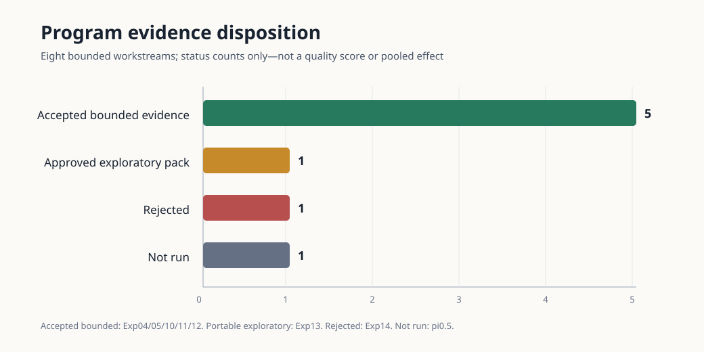

# Reflect Lite program evidence and decision ledger

Date: 2026-08-24. Synthesis base: `80efbd25c7812b9edd077b70e29eb35a0019ad79`.

## Decision

The current evidence justifies a **typed, layered synthetic reference architecture**, not completion of the Reflect Lite research program. Five bounded workstreams are accepted at their narrow scientific or engineering scopes; Exp13 is separately approved only as a portable exploratory pack whose formal disposition remains `INVALID_EXPERIMENT`. Together they support keeping live belief separate from durable geometry/semantics, keeping episodic events separately addressable, separating appearance-sensitive semantics from geometry, and making refresh/retrigger/replan explicit policies. They do not yet establish a learned VLA policy, real perception, physical transfer, an end-to-end three-level hierarchy, or that recovery should always occur at the lowest sufficient level.

The cross-experiment graphic is deliberately a disposition count. Effect sizes from different simulators, endpoints, and seed units are not pooled.



Source table: `cross-experiment-evidence.csv`. Reconstruct the SVG by grouping its rows by `plot_group`, counting rows, ordering by `plot_order`, and using `plot_color`; do not transform `headline_effect`. The PNG is an exact raster companion generated from the SVG with `/opt/homebrew/bin/rsvg-convert -o cross-experiment-evidence.png cross-experiment-evidence.svg` (`rsvg-convert 2.62.3`).

## Evidence ledger

| Workstream | Standing and exact approved scope | Decision-useful result | Authority and artifact |
|---|---|---|---|
| Exp04 unfixed memory | **Accepted indicative synthetic causal evidence.** Frozen generator/controller only. | `LIVE_SEPARATE - FIXED_M5` correctness `+0.5534`, paired 95% interval `[+0.5039,+0.6003]`, effective n=64; all 6 gates passed. | Source `9369114`; evidence `c036cd7`; approval merge `0c6bae9`; evidence-manifest SHA-256 `ecb7eed6…f8b97`. |
| Exp05 typed twin | **Accepted preliminary engineering evidence.** Synthetic typed twin, two frozen runs; no individual-layer causal claim. | Pooled matched `T3 live belief - T2 semantics` success `+37.50 pp`, descriptive two-run cluster interval `[+34.12,+40.88]`; `T4 - T3` `+2.62 pp` `[+1.38,+4.12]`. | Frozen planner fingerprint `d5f1ea24…3a8`; evidence `37b907d`; final mainline fix `be3397b`; evidence-manifest SHA-256 `0877d8fa…77cd`. |
| Exp10 storage x trigger | **Accepted strict synthetic white-box engineering evidence.** Oracle typed semantics, not VLA. | Under periodic triggering, `LIVE_EPISODIC - FIXED_SNAPSHOT` completion `+0.75000000`; under no memory, `HYBRID - PERIODIC_ONLY` `+0.40833333` `[+0.375,+0.44166667]`, n=20 seed clusters. | Freeze `11fb668`; evidence `4a570e1`; lifecycle head `df3ba59`; approval merge `b92a90f`; matrix SHA-256 `d564d798…920a`. |
| Exp11 trigger dose response | **Accepted synthetic typed-oracle engineering evidence.** Not VLA or robot evidence. | All 84 registered outcome gates passed across 28 effects; n=12 seed clusters, 10,000 draws. Prompt completion contrasts were exactly zero while prompt cost changed, so wording is not promoted as a semantic-control mechanism. | Freeze `e1cd3b3`; evidence `ffc27b8`; lifecycle head `8f719ec`; approval merge `2c3ffa1`; root-manifest SHA-256 `fe3d5e74…ccb0a`. |
| Exp12 opaque→glass-like | **Accepted indicative synthetic rendered-transfer evidence.** Appearance-only matched MuJoCo manipulation. | Glass-like safe completion: RGB-only `0/12`; RGB-D motion `12/12`; hierarchy `12/12`. Geometry-aware transfer drop was zero; hierarchy and RGB-D were identical. | Freeze `f0bd0ca`; evidence `1ef923f`; final verifier `2b9fd50`; approval merge `df42bf8`; V3 manifest SHA-256 `36694e7c…0497`. |
| Exp13 direct hierarchy | **Approved portable exploratory pack only.** Exact scope: `INVALID_EXPERIMENT / EXPLORATORY_PHYSICAL_HIERARCHY_SIGNAL`; no confirmatory support or causal-lowest claim. V1/V2 remain `INVALID_PARTIAL`. | Equal-seed R3−R2: success `−0.0100` `[−0.0300,0]`, progress `−0.008826` `[−0.026479,≈0]`, safety composite `+0.0100` `[0,+0.0300]`, total wakes `−0.637273` `[−0.672727,−0.595758]`, n=10. P4−P6 success is `−0.357576` `[−0.422727,−0.300000]`, n=5. These are exploratory synthetic outcomes only. | Source `59753c2`; freeze `bf5268e` (freeze SHA-256 `324e8c4f…ddb3c`); closure fix `9bb61ca`; evidence HEAD `374cb836776675bbcb7232ce8082309eab4f1432`; compact-pack seal SHA-256 `d311b5224142a9aa8fb57615ac16fc50978532f1a314aa7710a50ff97e8bb4b1`. The compact pack passed independent review with zero Critical/Important findings. The full 1.3 GB trace root remains local-only and is not promoted. |
| Exp14 mission ceiling | **Rejected: `REJECTED_EVIDENCE_AUTH`.** Descriptive deterministic mission-logic replay only. | Full-minus-open completion descriptively `+0.1866319` `[+0.1822917,+0.1931424]`, n=12, but live-memory and lower-recovery behavior was identical in all 2,304 pairs. | Source `23a300f`; evidence `e8b8198`; review `52fb19b`; review SHA-256 `72716ea3…03a6`. Coherent evidence substitution passed qualification; graphs/shards/mission heterogeneity were incomplete. |
| Exp09 pi0.5 | **`NOT_RUN`.** Static interface finding and synthetic transport fixture only. | Pinned OpenPI source closes the public DROID response to 15x8 actions plus timing. No checkpoint download, forward pass, semantic plan, model outcome, or physical execution occurred. | Pinned OpenPI `15a9616a…2ccac`; probe head `914fd12`; root evidence-manifest SHA-256 `cf380674…c2f0`. |

Ellipses above abbreviate hashes only for readability; the CSV records every cited SHA-256 and commit in full.

## Architecture decision map

| Program arrow or state choice | Decision now | Evidence basis | Missing test / non-claim |
|---|---|---|---|
| Durable semantic/geometric twin → live belief | **Keep separate.** Durable identity, topology, geometry, and policy must not be silently overwritten by inferred current state. | Exp05 T2→T3 jump and construction-enforced typed views; Exp04 live semantic update benefit. | Real IFC/USD adapters, real sensor identity, confidence calibration, distributed consistency. |
| Live belief ↔ episodic events | **Separate stores with explicit provenance; compose at query time.** | Exp04 semantic-only and episodic-only contrasts identify complementary mutation/history roles; Exp10/11 show storage interacts with trigger policy. | Retention, compression, contradiction resolution, privacy, and long-duration drift are untested. “Unfixed memory” is supported only as online separated updating in a toy generator. |
| Semantic object graph ↔ geometric/topological twin | **Separate appearance/labels from metric collision geometry while retaining typed identity links.** | Exp05 layer ownership; Exp12 RGB fails on glass-like appearance while depth geometry transfers. | Real glass/refraction/depth dropout, learned grounding, calibration drift, dynamic-object physics. |
| Mission → semantic planner → typed `SkillSpec` | **Retain as the intended boundary, not an empirical selection yet.** Semantic planner owns predicates, constraints, skill selection, verification, and semantic replan—not motor targets. | Exp05 typed planning boundary and Exp14’s bounded mission-logic observations are interface probes. | Exp14 is rejected and receives full ground truth; pi0.5 emitted no semantic plan. Learned planner quality and paraphrase robustness remain open. |
| Semantic retry/replan | **Use explicit triggers for invalid preconditions, object/restriction change, or failed verification.** | Exp10 storage×trigger interactions; Exp11 dose-response and disturbance heterogeneity; Exp05 instruction/restriction handling. | Trigger results use typed oracles. False-trigger costs under learned perception and end-to-end semantic replanning are not established. |
| Motion refresh/retrigger/replan | **Expose separately from semantic replanning.** Geometry-aware motion may replan without changing mission semantics. | Exp12 shows a geometry-aware motion path transfers across appearance; Exp10/11 distinguish failure families and trigger policies. Exp13 now supplies a portable exploratory disposition pack. | Exp12 contains no post-plan recovery event and its hierarchy equals RGB-D motion. Exp13 remains a formally invalid exploratory experiment, not accepted confirmatory motion-recovery evidence. |
| Control retry / fast stabilization | **Keep local and bounded in the contract, but do not claim its selected implementation from this synthesis.** | Exp10/11 control-failure strata provide engineering trigger checks. | No accepted physical PID/impedance/whole-body comparison here; no validated control-level causal recovery result. |
| `SkillSpec` → policy representation → action chunk/MPC/residual → executor | **Unresolved by this evidence subset.** Preserve typed interfaces and explicit validity/age/fallback fields. | Program contract plus engineering closure only. | Representation choice, temporal protocol, learned-policy latency, and VLA-to-controller transfer require the dedicated accepted experiments or new runs; they are not inferred from Exp04/05/10/11/12. |
| Recovery at lowest sufficient layer | **Plausible design rule, not a demonstrated causal law.** | Exp10/11 show layer-specific trigger effects in constructed typed-oracle dynamics; Exp13 preserves bounded exploratory direct outcomes. | Exp13 explicitly sets `causal_lowest_claim=false`; Exp14’s lower-recovery variant is behaviorally identical to live memory. No promotion to causal-lowest. |
| Learned world model / VLA | **Gap: no runtime role selected.** | pi0.5 static inspection identifies an action-only public boundary. | Model inference is `NOT_RUN`; no VLA semantics, candidate ranking, veto value, latency, or downstream task outcome exists. |

## What is scientifically supported now

1. **Synthetic causal:** online, separately addressable semantic and episodic memory beats a fixed snapshot in Exp04’s matched generator; geometry-derived sensing resists the appearance manipulation that defeats RGB-only detection in Exp12.
2. **Engineering:** typed twin layers, explicit provenance, and explicit trigger policies are useful implementation choices in Exp05/10/11’s frozen constructed worlds.
3. **Exploratory portable only:** Exp13’s corrected compact pack is independently approved as reconstructable exploratory evidence. Its formal `INVALID_EXPERIMENT` disposition, local-only full trace root, and no-confirmatory/no-causal limits remain controlling.
4. **Rejected:** Exp14 cannot qualify a mission-memory/recovery mechanism despite replayable descriptive raw facts.
5. **Not run:** pi0.5 model inference and the external VLA lane remain open.

## Program success-criterion disposition

The Section 36 arrow chain is **partially justified** through the memory/twin/trigger/perception seams. It is **not empirically closed** from mission language through a learned general/specialist policy to temporal execution, MPC/IK, and physical low-level control. The state stack should presently be written as:

```text
durable semantic identity + durable metric/topological geometry
        ↓ typed links, never silent overwrite
timestamped live belief/confidence/provenance
        ↔ bounded episodic events
        → layer-specific refresh / retrigger / replan / abort proposals
```

Recent robot state remains an executor input, but no accepted result in this synthesis selects its production retention policy. A learned world model has no measured bounded decision role. Unitree R1 transfer, remote GPU/VLA inference, real sensors, and physical deployment remain outside the accepted evidence.

Therefore the program status is **PARTIAL_INDICATIVE_EVIDENCE — CONTINUE**, not `COMPLETE`. The next promotion gate is not more scaffolding: run one compact learned-policy/VLA inference study and one new valid confirmatory direct layer-recovery study with portable full raw traces. Only after those pass should the full architecture arrow diagram be called experimentally selected.
